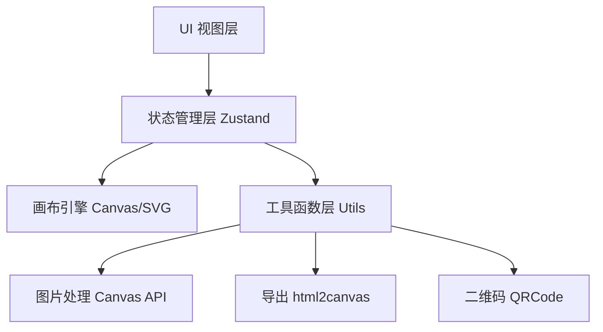

## 1. 架构设计



## 2. 技术描述

- 前端：React@18 + TypeScript + Vite + TailwindCSS@3 + Zustand
- 图片处理：原生 Canvas API
- 导出：html-to-image
- 二维码：qrcode.react
- 字体：Google Fonts API

## 3. 路由定义

| 路由 | 用途 |
|-------|---------|
| / | 主编辑器页面 |

## 4. 数据模型

### 4.1 CanvasElement（画布元素）
- id: string
- type: 'text' | 'image' | 'shape' | 'qr' | 'icon'
- x: number
- y: number
- width: number
- height: number
- rotation: number
- locked: boolean
- opacity: number
- zIndex: number
- styles: object（样式配置）

### 4.2 CanvasState（画布状态）
- elements: CanvasElement[]
- selectedId: string | null
- background: string
- canvasSize: { width: number, height: number }
- zoom: number
- history: CanvasState[]
- historyIndex: number

### 4.3 Project（项目）
- id: string
- name: string
- thumbnail: string
- createdAt: number
- updatedAt: number
- canvasState: CanvasState
- versions: { timestamp: number, state: CanvasState }[]
- shareToken: string | null

## 5. 目录结构

```
src/
├── components/
│   ├── canvas/        # 画布相关组件
│   ├── panels/      # 左右面板组件
│   ├── toolbar/     # 顶部工具栏
│   ├── common/      # 通用UI组件
│   └── modals/      # 弹窗组件
├── store/           # Zustand状态管理
├── hooks/           # 自定义Hooks
├── utils/           # 工具函数
├── types/           # TypeScript类型定义
├── data/            # 模板/预设数据
└── pages/           # 页面组件
```
